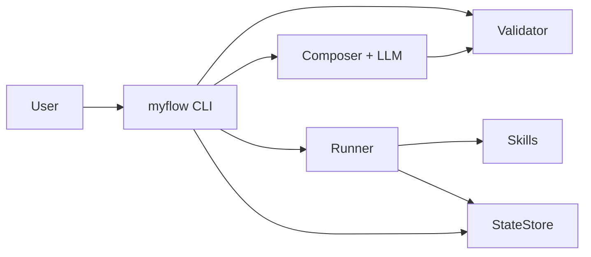

# MyFlow

AI 工作流生成与执行引擎：用自然语言生成 YAML 工作流，经确定性校验后由 Runner 逐步执行，并支持断点续跑与运行记录查询。

**目录（大节）** · [第一部分 设计与架构综述](#part1) · [第二部分 安装与使用指南](#part2) · [第三部分 阶段实施与测试记录](#part3) · [经验总结](#lessons)

---

<a id="part1"></a>

## 第一部分：设计与架构综述

**本部分目录** · [1.1 设计亮点](#11-设计亮点) · [1.2 架构与数据流](#12-架构与数据流) · [1.3 核心对象一览](#13-核心对象一览) · [1.4 设计演进与变更要点](#14-设计演进与变更要点) · [1.5 质量指标与阶段四完成线](#15-质量指标与阶段四完成线) · [1.6 开发状态说明](#16-开发状态说明)

### 1.1 设计亮点

以下 8 条概括了系统中最值得先看的设计决策。每条关联到设计文档或实现的具体位置，便于深入查阅。

- **三层架构，依赖单向向下。** 入口层（CLI）只做解析与展示；引擎层（Runner / Validator / Composer / Skills）承载全部业务；基础设施层（StateStore / LLMClient / Config）适配外部依赖。任何一层都不反向 import 上层。对应 [设计文档](MyFlow_完整设计文档.md) §3。
- **YAML 替代 Markdown DSL。** 工作流定义使用标准 YAML 格式，有成熟解析器（ruamel.yaml），无需自写正则 Parser。LLM 生成 YAML 比生成特定格式的 Markdown 更稳定，且 YAML 与 Pydantic 的 dict 形式天然兼容。对应设计文档 §4。
- **模板解析三类语义。** `step.inputs` 中整段 `{{var}}`（保留原始类型）、字符串内插多占位（逐个替换为 `str`）、以及无花括号的字面量，由 Runner 统一解析。这是修复「合规 YAML 仍带未展开 `{{…}}`」类问题的基础。根因讨论见 [benchmark_failures.md](tests/e2e/benchmark_failures.md) P1。
- **每步 `outputs` 为显式 dict 映射。** `key` 为写入运行上下文的变量名，`value` 为技能 Pydantic 输出模型上的字段名。配合校验器的 `INVALID_OUTPUT_FIELD` 错误码，避免「技能只返回 `generated_text`、下游却引用 `final_document`」类静默空结果。对应设计文档 §4.2–§4.4。
- **确定性校验 + Composer 回流闭环。** `myflow generate` 在 `compose_until_valid` 中把 `Validator` 报告反馈给 LLM，直到 `execution_ready()` 为真或达最大重试。阻塞级 warning（如 `MERGEABLE_LLM_ANALYZE`）会参与该闭环。见 [benchmark_failures.md](tests/e2e/benchmark_failures.md) §8 与 [composer_system.md](src/myflow/prompts/composer_system.md)。
- **SkillCard 自动注入 Prompt。** 每个 Skill 类声明 `name / description / when_to_use / do_not_use_when / input_model / output_model`，SkillRegistry 在启动时自动提取为 SkillCard 文本并嵌入 Composer 的 System Prompt。LLM 无需"读一遍脚本"即可知道有哪些技能、怎么用。对应设计文档 §6。
- **Composer 二合一替代三角色。** 没有 Planner / Generator / Evaluator 三角色分离，一个 Composer + 一次 LLM 调用直出 WorkflowModel。Token 成本和调试复杂度降低一半。对应设计文档 §7.2。
- **按质量门槛卡阶段 5。** 在工作流可执行率、技能命中率、端到端成功率未达标前，不将 HTTP 服务、外部 `http_request` 等作为主线排期。本仓库当前无 `serve` 子命令。对应设计文档 §15.0、§17.1。

### 1.1.1 与前代项目（MyWorkflow V1–V4）的关键差异

| 维度 | 前代设计 | MyFlow | 改变原因 |
|------|---------|--------|---------|
| 架构层数 | 8 层 | 3 层 | 个人开发者无法维护 8 层抽象 |
| 工作流格式 | `.step.md`（Markdown DSL） | YAML | 标准解析器、LLM 生成更稳定 |
| LLM 角色数 | 3（Planner / Generator / Evaluator） | 1（Composer 二合一） | 减少 Token 成本和调试复杂度 |
| 校验模块 | 10 个文件的独立协议层 | 1 个 `validator.py` | 保留核心逻辑，砍掉过度抽象 |
| 结构化输出 | LangChain structured output | instructor + 原生 SDK | 减少抽象层，更可控 |
| 入口 | `main.py` 硬编码路径 | Typer CLI + Rich 输出 | CLI-First，专业美观 |
| 状态存储 | SQLite + 部分 pickle | SQLite + 全量 JSON | 安全序列化 |
| 元工作流 | 系统自身就是工作流 | 稳定后再考虑 | MVP 先行 |
| 目标代码量 | 18000+ 行 | ~1650 行 | 个人项目的合理规模 |
| 文档行数 | 数万字（超过代码量） | 本 README + 设计文档 | 设计体现在代码和测试中 |

### 1.2 架构与数据流



**生成路径：** 自然语言需求 → `WorkflowComposer` 调用 LLM（instructor 强制结构化输出）→ `WorkflowModel`（Pydantic 对象）→ `Validator` 确定性校验（技能白名单、变量可达性、输出字段合法性等 11+ 条规则）→ 校验通过则落盘 YAML；未通过则错误回流 Composer 重试。

**执行路径：** 加载 YAML → `Runner` 按步执行。每步依次完成：条件求值（simpleeval 沙盒）→ 解析 `inputs` 模板（整段引用 / 字符串内插 / 字面量）→ Pydantic 校验输入 → 调用 Skill → 按 `outputs` 映射写回上下文 → 持久化到 SQLite。支持 `on_fail` 重试跳转（上限 5 次）和 `--resume` 断点续传。

### 1.3 核心对象一览

下表列出系统中的关键 Pydantic 模型与模块，便于快速定位代码。

| 对象 | 文件 | 职责 |
|------|------|------|
| `WorkflowModel` | `engine/models.py` | 工作流完整定义：元数据 + 步骤列表 |
| `WorkflowStep` | `engine/models.py` | 单步定义：action、inputs、outputs、on_fail 等 |
| `ParamSpec` | `engine/models.py` | 工作流级输入/输出参数规格（类型、描述、是否必填） |
| `ValidationReport` | `engine/models.py` | 校验结果：errors / warnings / `execution_ready()` |
| `SkillCard` | `engine/models.py` | 技能元数据摘要，注入 Composer Prompt |
| `RunResult` / `StepResult` | `engine/models.py` | 运行与单步执行结果 |
| `Runner` | `engine/runner.py` | 步骤循环引擎，驱动工作流执行 |
| `WorkflowComposer` | `engine/composer.py` | LLM 工作流生成，调用 `compose_until_valid` |
| `WorkflowValidator` | `engine/validator.py` | 确定性规则校验（11+ 条规则） |
| `SkillRegistry` | `engine/skill_registry.py` | 技能注册、查找、SkillCard 生成 |
| `Skill` (抽象基类) | `skills/base.py` | 所有技能的接口定义 |
| `FileReaderSkill` | `skills/file_ops.py` | 统一读取：单文件 / 多文件 / 目录 / ZIP |
| `LLMAnalyzeSkill` | `skills/llm_call.py` | LLM 分析：归纳、对比、要点提取 |
| `LLMGenerateSkill` | `skills/llm_call.py` | LLM 生成：报告、代码、翻译 |
| `LLMVerifySkill` | `skills/llm_call.py` | LLM 验证：对照标准检查产物 |
| `StateStore` | `infra/state_store.py` | SQLite 状态持久化（run / step / checkpoint） |
| `LLMClient` | `infra/llm_client.py` | instructor + LLM SDK 封装 |
| `AppConfig` | `infra/config.py` | pydantic-settings 配置加载 |

### 1.3.1 Validator 校验规则一览

Validator 是系统的确定性判官。以下为当前实现的全部规则（代码层面的唯一来源）：

| 规则编号 | 错误码 | 规则描述 | 阻塞级 |
|---------|--------|---------|--------|
| R01 | `EMPTY_STEPS` | steps 列表不能为空 | 是 |
| R02 | `DUPLICATE_STEP_ID` | step.id 必须唯一且为正整数 | 是 |
| R03 | `UNKNOWN_ACTION` | step.action 必须在 SkillRegistry 白名单中 | 是 |
| R04 | `MISSING_OUTPUT` | step.outputs 至少声明一个变量 | 是 |
| R05 | `UNBOUND_VARIABLE` | inputs 引用的变量必须在前序 outputs 或工作流 inputs 中已声明 | 是 |
| R06 | `INVALID_ON_FAIL` | on_fail 目标必须 < 当前 step.id | 是 |
| R07 | `ON_FAIL_TARGET_MISSING` | on_fail 目标 step.id 必须实际存在 | 是 |
| R08 | `EXCESSIVE_RETRIES` | max_retries 不能超过 5 | 是 |
| R09 | `TEMPLATE_RESIDUE` | inputs 中不能残留空的模板语法 | 是 |
| R10 | `DANGER_KEYWORD` | description 中出现危险关键词时记录警告 | 警告 |
| R11 | `MISSING_WORKFLOW_PATH` | action=sub_workflow 时 workflow 字段必填 | 是 |
| R12 | `INVALID_OUTPUT_FIELD` | outputs 的 value 必须是该技能的合法输出字段 | 是 |
| — | `MERGEABLE_LLM_ANALYZE` | 多步 llm_analyze 且同 content 字面量应合并 | 阻塞级 warning |
| — | `SINGLE_BRACE_STYLE` | 整段单花括号建议改为双花括号 | 非阻塞 warning |

**`execution_ready()` 的语义：** `passed=True`（无 error）且无阻塞级 warning。`MERGEABLE_LLM_ANALYZE` 在 `BLOCKING_WARNING_CODES` 中，因此虽然是 warning 但会阻止 `execution_ready()`，并驱动 Composer 回流重试。

### 1.3.2 技能选择决策指南

| 场景 | 应选技能 | 常见误选 | 原因 |
|------|---------|---------|------|
| 总结 / 摘要 / 概括 / 提取要点 | `llm_analyze` | `llm_generate` | analyze 的 Skill Prompt 天然约束简洁输出 |
| 翻译 / 撰写 / 改写 / 生成代码 | `llm_generate` | — | 产出新内容 |
| 判断产物是否合格 | `llm_verify` | `llm_analyze` | verify 返回结构化的 passed/failed |
| 读取单个或多个文件 | `file_reader` | 自造 `csv_reader` 等 | file_reader 统一支持多种输入形态 |
| 最终保存结果 | `file_writer` | `llm_generate`（做汇总） | file_writer 的字符串内插是确定性的 |

### 1.4 设计演进与变更要点

下表将设计文档、根因级清单 [benchmark_failures.md](tests/e2e/benchmark_failures.md) 与当前实现对齐，标出「因何类问题」触发的方向性修改。

| 问题 ID | 现象 / 根因（摘要） | 主要落点 | 性质 |
|--------|-------------------|----------|------|
| P1 | 仅整段 `{{var}}` 时，串内多占位不展开，落盘与执行带未替换 `{{…}}` | [runner.py](src/myflow/engine/runner.py) 模板解析；设计文档 §4.2.1、§7.3 | 基础设施缺陷 |
| P2 | LLM 正文中留 `{{…}}`、`<待填写>` 等占位式交付 | [llm_call.py](src/myflow/skills/llm_call.py) system prompt 与 `_reject_placeholder_delivery` 后置检查 | LLM 技能 + Prompt |
| P3 | 输出与给定输入脱节（长代码、跑题） | Composer「锚定输入」规则 + `llm_verify`；设计文档阶段 4 / Prompt | 质量迭代 |
| P4 | 多路径拼进单个 `file_reader` → ENOENT | 统一 `file_reader`（支持单文件 / 多路径 / 目录 / ZIP）；设计文档 §6.3 | 技能能力 |
| P5 | 目录当文件读 / 权限失败 | 同 P4，`file_reader` 运行时识别目录并递归读取 | 技能与路径语义 |
| P6 | 批量脚本把路径填进「文案类」字段 | `scripts/batch_requirement_e2e.py` 与 `run_specs` 语义修正 | 批量与夹具 |
| P7 | 带 `--from-id` 等重跑时 `SUMMARY` 与全量历史列含义不一致 | [SUMMARY.md](requirement_batch_io/SUMMARY.md) 表头说明 | 报告脚本语义 |
| P8 | 无真正质量门闩的「成功」 | 工作流设计可加强 `llm_verify` 或外置检查 | 成功定义 |
| P9 | 多步同 `llm_analyze` 且同主输入应合并 | [composer_system.md](src/myflow/prompts/composer_system.md) 机械规则 + [validator.py](src/myflow/engine/validator.py) `MERGEABLE_LLM_ANALYZE` | Prompt + 确定性兜底 |

**与 P1–P9 正交的关键工程修正：**

`step.outputs` 从 `list[str]` 演进为 `dict[str, str]` 显式映射。Runner 仅按映射写入上下文，取消易错的隐式猜测。校验器新增 `INVALID_OUTPUT_FIELD` 错误码，在生成阶段即可发现「YAML 声明的输出字段名与技能实际返回字段名不一致」。规范与错误码以设计文档 §4.2、§4.3、§4.4 与 `Validator` 实现为准。

### 1.5 质量指标与阶段四完成线

设计文档 §13.3 定义了可统计的指标与目标；§15 阶段 4 将其中与对外交付强相关的三条写为进入阶段 5 的完成线：

| 指标 | 定义 | 目标值 | 测量方法 |
|------|------|--------|---------|
| 工作流可执行率 | 生成的工作流能通过 `execution_ready()` 严格校验的比例 | ≥ 90% | 对测试需求各生成 3 次，统计通过率 |
| 技能命中率 | 工作流中 `action` 全部在已注册技能白名单内的比例 | ≥ 95% | 同上 |
| 端到端成功率 | 生成的工作流能被 Runner 成功执行完成的比例 | ≥ 70% | 20 条真实需求批跑 + e2e 测试 |

**当前观测（截至 [SUMMARY.md](requirement_batch_io/SUMMARY.md) 最近快照）：**

- 20 条需求均已生成且校验列通过（可执行率 100%，含阻塞级 warning 重试后收敛）。
- 尝试执行 20 条，端到端成功 **17/20 = 85.0%**（含读盘修复与复测后的合并口径，详见 [benchmark_failures.md](tests/e2e/benchmark_failures.md) §10.5）。
- 仍失败的 3 条（01、10、18）主要失败于 `llm_verify`（翻译质量 / 测试代码质量），非引擎或读盘问题。

**说明：** SUMMARY.md 由 `scripts/requirement_batch_report.py` 自动生成，会随重跑覆盖。上述数字仅为观测值，不等于已达阶段 4 完成线的正式声明。

### 1.6 开发状态说明

- **仍在积极开发。** 引擎、Composer、CLI 与测试持续迭代；以仓库代码与设计文档修订为最终依据。
- **阶段 5（HTTP / `serve` / `http_request`）：** 设计文档 §17 已规划，本仓库尚未提供 `myflow serve` 或对应技能文件。
- **阶段 4 质量收敛：** 批量汇总未达到 §13.3 / §15 阶段 4 完成标志中的全部阈值时，项目按设计文档约定冻结阶段 5 主线开发，优先收敛引擎与 Prompt。
- **设计文档与代码不一致时：** 以代码为准。设计文档末尾附录 B 对已知差异有说明。

---

<a id="part2"></a>

## 第二部分：安装与使用指南

**本部分目录** · [2.1 环境与依赖](#21-环境与依赖) · [2.2 安装](#22-安装) · [2.3 CLI 命令一览](#23-cli-命令一览) · [2.4 命令详解](#24-命令详解) · [2.5 调用示例](#25-调用示例) · [2.6 环境变量](#26-环境变量) · [2.7 工作流 YAML 编写指南](#27-工作流-yaml-编写指南) · [2.8 批量测试与回归](#28-批量测试与回归)

### 2.1 环境与依赖

- **Python**：≥ 3.11（见 [pyproject.toml](pyproject.toml)）。
- **包管理**：推荐使用 [uv](https://docs.astral.sh/uv/)。
- **LLM API**：需要 Anthropic / OpenAI / DeepSeek 等提供商的 API Key。

### 2.2 安装

```bash
git clone <本仓库 URL>
cd workflow3.0
uv sync
cp .env.example .env   # Windows: copy .env.example .env
```

编辑 `.env`，至少配置 **`MYFLOW_LLM_API_KEY`**（详见 [2.6](#26-环境变量)）。

验证安装成功：

```bash
uv run myflow --help
```

入口命令为 **`myflow`**（由 [pyproject.toml](pyproject.toml) `[project.scripts]` 注册）。

### 2.3 CLI 命令一览

| 命令 | 作用 | 说明 |
|------|------|------|
| `myflow` | 根命令 | 支持 `--debug` 全局选项 |
| `myflow run` | 执行工作流 YAML | 支持 `--input`、`--verbose`、`--resume` |
| `myflow generate` | 自然语言生成工作流 | 支持 `--output`、`--run`（生成后立即执行）|
| `myflow validate` | 校验 YAML 定义 | 含阻塞级 warning 时 exit 非 0 |
| `myflow list-workflows` | 列出工作流目录下所有 YAML 摘要 | 扫描 `MYFLOW_WORKFLOWS_DIR` |
| `myflow show` | 展示单个工作流的契约与步骤 | 含输入/输出参数、步骤列表、用法示例 |
| `myflow list` | 列出运行记录（SQLite） | 不同于 `list-workflows`：后者列 YAML 定义，本命令列执行历史 |
| `myflow logs` | 查看某次运行的步骤历史 | 支持 run_id 前缀匹配 |
| `myflow status` | 查看单次运行状态与断点 | 缺省时打印用法并列出最近运行 |

常见退出码：成功 `0`；校验/业务失败 `1`；参数或路径错误 `2`。

### 2.4 命令详解

以下与 `uv run myflow <cmd> --help` 一致（节选说明）。

#### 2.4.1 全局选项

```bash
myflow [--debug]
```

| 选项 | 含义 |
|------|------|
| `--debug` | 启用结构化调试日志（stderr）；也可设环境变量 `MYFLOW_DEBUG=1` |

#### 2.4.2 `myflow run`

```bash
myflow run [OPTIONS] WORKFLOW_PATH
```

| 参数/选项 | 含义 |
|-----------|------|
| `WORKFLOW_PATH` | 工作流 YAML 路径；可用相对路径，也可省略 `.yaml` 后缀 |
| `-i`, `--input` | 多次传入 `key=value`，注入工作流 `inputs`。每个 key 对应工作流 `inputs` 中声明的参数名 |
| `-v`, `--verbose` | 每步成功后打印该步全部 `outputs` 内容到终端 |
| `--resume` | 指定 `run_id`，从上次中断的步骤断点续跑 |

**关于 `--verbose` 与终端展示：** 当工作流未使用 `file_writer`（或用户未要求落盘）时，引擎默认在 CLI 中展示最后一步的 `outputs`。加 `--verbose` 后展示每一步的 `outputs`。这意味着「不写文件、只看终端结果」的工作流完全可行。

#### 2.4.3 `myflow generate`

```bash
myflow generate [OPTIONS] REQUIREMENT
```

| 参数/选项 | 含义 |
|-----------|------|
| `REQUIREMENT` | 自然语言需求描述（用引号包裹） |
| `-o`, `--output` | 输出 YAML 路径（默认写入 `MYFLOW_WORKFLOWS_DIR` 下） |
| `-v`, `--verbose` | 显示校验与重试过程 |
| `--run` | 校验通过后立即执行（无初始 `--input`，需与工作流契约一致） |

**内部流程：** Composer 调用 LLM → 得到 WorkflowModel → Validator 校验 → 如果 `execution_ready()` 为 false → 将错误回流给 LLM → 重试（最多 `MYFLOW_COMPOSER_MAX_ATTEMPTS` 次）→ 通过则保存 YAML。

#### 2.4.4 `myflow validate`

```bash
myflow validate WORKFLOW_PATH
```

对单文件做与 `generate` 后相同的严格校验。含阻塞级 warning（如 `MERGEABLE_LLM_ANALYZE`）时 exit 非 0。

#### 2.4.5 `myflow list-workflows`

无额外参数；扫描 `MYFLOW_WORKFLOWS_DIR`，按名称列出每个 YAML 的 `name`、`description`、步骤数。

#### 2.4.6 `myflow show`

```bash
myflow show NAME_OR_PATH
```

按逻辑名、相对或绝对路径定位一个工作流，展示：输入参数表（类型、是否必填、描述）、输出参数表、步骤列表（含 on_fail 信息）、命令行用法示例。与 `list-workflows` 配合使用：先 `list-workflows` 找到名字，再 `show` 查看详情。

#### 2.4.7 `myflow list`

```bash
myflow list [OPTIONS]
```

| 选项 | 含义 |
|------|------|
| `-n`, `--limit` | 列出最近若干条运行，默认 20 |
| `--full-id` | 显示完整 `run_id`（默认显示前 8 位） |

**与 `list-workflows` 的区别：** `list-workflows` 列出磁盘上的工作流定义文件；`list` 列出 SQLite 中的运行记录。一个是"有哪些工作流可以跑"，一个是"跑过哪些、结果如何"。

#### 2.4.8 `myflow logs` 与 `myflow status`

```bash
myflow logs RUN_REF      # run_id 或其唯一前缀
myflow status [RUN_REF]  # 缺省时列出最近运行供选择
```

`logs` 展示该次运行的完整步骤历史（每步状态、耗时、输出摘要）。`status` 展示单次运行的当前状态与断点位置（适用于 `--resume` 前确认）。

### 2.5 调用示例

#### 基本工作流程（生成 → 校验 → 执行）

```bash
# 1. 生成工作流
uv run myflow generate "读取 README.md，用 LLM 总结要点" -o workflows/summarize.yaml

# 2. 查看生成的工作流结构
uv run myflow show summarize

# 3. 校验（可选，generate 内部已校验）
uv run myflow validate workflows/summarize.yaml

# 4. 执行
uv run myflow run workflows/summarize.yaml -i file_path=./README.md -v
```

#### 多输入参数

```bash
uv run myflow run workflows/translate_doc.yaml \
  -i source_path=./paper.txt \
  -i target_language=中文 \
  -i output_path=./paper_cn.txt
```

#### 断点续传

```bash
# 首次执行中断后
uv run myflow list              # 找到 run_id
uv run myflow status abc12def   # 确认断点位置
uv run myflow run workflows/my_wf.yaml --resume abc12def
```

#### 生成后立即执行

```bash
uv run myflow generate "分析 data.csv 的数据趋势" --run
```

#### 管理命令

```bash
uv run myflow list-workflows    # 列出所有可用工作流
uv run myflow list              # 列出运行历史
uv run myflow logs abc12def     # 查看某次运行详情
```

#### 批量需求汇总（20 条）

```bash
# 全量批跑（会改写 requirement_batch_io/SUMMARY.md）
uv run python scripts/requirement_batch_report.py

# 从第 11 条开始（跳过已跑的前 10 条）
uv run python scripts/requirement_batch_report.py --from-id 11

# 跳过特定条目（如卡在 10 和 18）
uv run python scripts/requirement_batch_report.py --skip-ids 10,18
```

### 2.6 环境变量

可通过 `.env` 或系统环境变量设置（前缀 **`MYFLOW_`**，由 [config.py](src/myflow/infra/config.py) 读取）。

#### 核心配置

| 变量 | 含义 | 默认值 |
|------|------|--------|
| `MYFLOW_LLM_PROVIDER` | LLM 提供商：`anthropic` / `openai` / `deepseek` 等 | `anthropic` |
| `MYFLOW_LLM_MODEL` | 模型名称 | `claude-sonnet-4-20250514` |
| `MYFLOW_LLM_API_KEY` | API 密钥（`generate` 必需） | — |
| `MYFLOW_LLM_BASE_URL` | 可选，OpenAI 兼容网关地址 | — |
| `MYFLOW_LLM_TEMPERATURE` | 采样温度 | `0.3` |
| `MYFLOW_WORKFLOWS_DIR` | 工作流根目录 | `workflows` |
| `MYFLOW_DB_PATH` | SQLite 路径 | `myflow_state.db` |
| `MYFLOW_DEBUG` | 设为 `1` 等价于 CLI `--debug` | `0` |

#### Composer / 缓存

| 变量 | 含义 |
|------|------|
| `MYFLOW_COMPOSER_MAX_ATTEMPTS` | Composer 校验重试最大次数 |
| `MYFLOW_CHAMPION_CACHE_ENABLED` | 是否启用 Champion 缓存（按需求 hash 复用成功产物）|
| `MYFLOW_CHAMPION_CACHE_DIR` | Champion 缓存目录 |

#### 基准与质量测试

| 变量 | 含义 | 注意 |
|------|------|------|
| `MYFLOW_RUN_BENCHMARK` | 置为 `1` 开启真实 LLM 基准测试 | 会产生 API 费用 |
| `MYFLOW_BENCHMARK_STRICT` | 配合上一项，对 20×3 次生成断言 §13.3 阈值 | 耗时长、费用高 |
| `MYFLOW_RUN_LLM_TESTS` | 部分 live 集成测试开关 | — |

### 2.7 工作流 YAML 编写指南

手动编写或审查 Composer 生成的 YAML 时，注意以下要点（完整规范见设计文档 §4）：

**inputs 的三种合法写法：**

```yaml
inputs:
  # 纯变量引用（保留原始类型）
  content: "{{file_content}}"

  # 字符串内插（变量替换为 str 后拼接）
  instruction: "将以下内容翻译为{{target_language}}：{{source_text}}"

  # 字面量（原样传递）
  criteria: "报告必须包含摘要和结论"
```

**outputs 必须是 dict 映射：**

```yaml
outputs:
  # key: 写入上下文的变量名（自定义）
  # value: 技能 Pydantic 输出模型的字段名（必须与技能定义一致）
  translated_text: generated_text    # 把 llm_generate 的 generated_text 存为 translated_text
  summary: analysis_result           # 把 llm_analyze 的 analysis_result 存为 summary
```

**on_fail 指向正确的步骤：**

```yaml
- id: 3
  name: 验证报告
  action: llm_verify
  on_fail: 2    # 失败时回到步骤 2（生成报告），不是步骤 1（读文件）
  max_retries: 3
```

**已注册的技能名称（`step.action` 只能使用以下值）：**

| 技能 | 用途 | 幂等 | 主要输出字段 |
|------|------|------|-------------|
| `file_reader` | 读取文件（支持单文件、多路径逗号分隔、目录、ZIP） | 是 | `file_content` (str), `file_count` (int) |
| `file_writer` | 写入文件 | 否 | `report_path` (str), `bytes_written` (int) |
| `llm_analyze` | LLM 分析：归纳、对比、要点提取 | 是 | `analysis_result` (str), `confidence` (float) |
| `llm_generate` | LLM 生成：报告、代码、翻译 | 是 | `generated_text` (str) |
| `llm_verify` | LLM 验证：对照标准检查产物 | 是 | `verify_result` (str), `passed` (bool) |
| `sub_workflow` | 调用已注册的子工作流 | — | 由子工作流决定 |

**完整工作流示例（含验证循环）：**

```yaml
name: translate_and_summarize
description: 读取英文论文，翻译为中文并生成摘要
version: "1.0"

inputs:
  paper_path:
    type: string
    description: 英文论文文件路径
  output_path:
    type: string
    description: 输出文件路径

outputs:
  result_path:
    type: string
    description: 翻译与摘要文件路径

steps:
  - id: 1
    name: 读取论文
    action: file_reader
    inputs:
      file_path: "{{paper_path}}"
    outputs:
      paper_content: file_content

  - id: 2
    name: 翻译全文
    action: llm_generate
    inputs:
      instruction: "将以下英文论文翻译为中文，保持学术用语准确性"
      context: "{{paper_content}}"
    outputs:
      translated_text: generated_text

  - id: 3
    name: 生成摘要
    action: llm_analyze
    inputs:
      content: "{{translated_text}}"
      instruction: "用 3-5 句话概括这篇论文的核心观点和结论"
    outputs:
      summary: analysis_result

  - id: 4
    name: 验证摘要质量
    action: llm_verify
    inputs:
      artifact: "{{summary}}"
      criteria: "摘要必须涵盖论文的研究目的、方法和结论，不得遗漏核心论点"
    outputs:
      verify_result: verify_result
    on_fail: 3
    max_retries: 2

  - id: 5
    name: 保存结果
    action: file_writer
    inputs:
      file_path: "{{output_path}}"
      content: "# 摘要\n\n{{summary}}\n\n---\n\n# 全文翻译\n\n{{translated_text}}"
    outputs:
      result_path: report_path
```

**常见错误与正确写法：**

| 错误 | 正确 | 原因 |
|------|------|------|
| `outputs: [translated_text]` | `outputs: {translated_text: generated_text}` | outputs 必须是 dict 映射 |
| `action: analyze_data` | `action: llm_analyze` | 必须使用注册的技能名 |
| `on_fail: 5`（当前步 id 也是 5） | `on_fail: 3`（< 当前步 id） | on_fail 只能向前跳 |
| `content: "{{a}},{{b}},{{c}}"` 传给 file_reader | 使用 `multi_file_reader` 或拆多步 | file_reader 按单路径读取 |
| 在工作流 inputs 中暴露 instruction | 将 instruction 写为步骤字面量 | instruction 是实现细节 |

### 2.8 批量测试与回归

20 条真实需求的批量测试体系：

| 组件 | 路径 | 说明 |
|------|------|------|
| 需求元数据 | `requirement_batch_io/batch_manifest.yaml` | 20 条需求定义（id、分级、需求文本、夹具提示） |
| 输入夹具 | `requirement_batch_io/fixtures/` | 各需求对应的测试数据文件 |
| 运行配置 | `requirement_batch_io/run_specs.yaml` | 每条需求的 `--input` 参数 |
| 运行产物 | `requirement_batch_io/runs/XX/` | 各需求的执行输出文件 |
| 汇总报告 | `requirement_batch_io/SUMMARY.md` | 脚本自动生成的一览表（随重跑覆盖） |
| 批量脚本 | `scripts/requirement_batch_report.py` | 全量或子集批跑 + 汇总 |
| 失败分析 | `tests/e2e/benchmark_failures.md` | 根因级失败形态与修复追踪（P1–P9） |

---

<a id="part3"></a>

## 第三部分：阶段实施与测试记录

**本部分目录** · [3.0 实施总原则](#30-实施总原则) · [3.1 阶段 1–4（实施记录）](#31-阶段-14实施记录) · [3.2 阶段 5（规划与状态）](#32-阶段-5规划与状态) · [3.3 测试与质量保障](#33-测试与质量保障) · [3.4 Prompt 调优专项](#34-prompt-调优专项) · [3.5 典型失败案例](#35-典型失败案例) · [经验总结](#lessons)

### 3.0 实施总原则

与设计文档 §15.0 一致，实施分为两类工作：

**第一类：基础设施修复。** 模板解析、`outputs` 映射、技能契约等——不修则批量测试结果不可信。这类必须先完成，在可信基线上再做质量迭代。

**第二类：质量迭代。** LLM Prompt 调优、Composer 规则加强、few-shot 示例优化。遵循「一次改一项 → 重跑回归 → 记录数据」的节奏，避免未测先堆多项改动。

### 3.1 阶段 1–4（实施记录）

#### 阶段 1：骨架与执行（第 1 周）

**目标：** `myflow run hello_world.yaml` 成功执行。

| 任务 | 产出 | 备注 |
|------|------|------|
| 项目结构、pyproject.toml、依赖 | 完整目录结构 | uv sync 通过 |
| Pydantic 数据模型 | `engine/models.py` | WorkflowModel / WorkflowStep / ValidationReport 等 |
| 配置加载 | `infra/config.py` | pydantic-settings + .env |
| Skill 基类 + file_reader / file_writer | `skills/base.py`, `skills/file_ops.py` | 含 SkillCard 自动生成 |
| SkillRegistry | `engine/skill_registry.py` | 注册、查找、白名单 |
| Validator（11 条规则） | `engine/validator.py` | 正向 + 反向单测全部通过 |
| StateStore | `infra/state_store.py` | SQLite 存取与恢复 |
| Runner | `engine/runner.py` | 步骤循环、条件求值、on_fail、断点续传 |
| CLI `run` 命令 + Display | `cli.py`, `display.py` | Rich 格式化输出 |

**关键修复（P1）：** Runner 模板解析支持三类语义——整段引用（保类型）、字符串内插（逐个替换为 str）、字面量。这是阶段 1 必须完成的基础设施修复。修复前，Composer 按人类直觉生成的合法 YAML（如 `"翻译为{{lang}}：{{text}}"`）会原样进入技能，导致大量产物中出现未替换的 `{{…}}`——这曾被误判为"LLM 幻觉"。

**关键修复（outputs dict）：** `WorkflowStep.outputs` 从 `list[str]` 改为 `dict[str, str]`。旧设计中 outputs 只是一个名字列表（如 `[translated_text]`），无法表达"技能返回的 `generated_text` 字段应存为上下文的 `translated_text`"。Runner 只能猜测映射关系，多步串联 `llm_generate` 时后一步覆盖前一步的 `generated_text`。改为 dict 后映射关系在 YAML 中白纸黑字，Runner 不再猜测，取消了 `_apply_step_output_aliases` 等隐式兜底逻辑。配合 `INVALID_OUTPUT_FIELD` 校验规则，在生成阶段即可发现字段名不一致。

**阶段 1 完成标志：**

```bash
$ myflow run workflows/examples/hello_world.yaml --input file_path=/tmp/test.txt -v
  ✓ Step 1 │ 读取文件     │ file_reader  │ 12ms
    file_content: "hello world\n"
  ✓ Step 2 │ 写入文件     │ file_writer  │ 8ms
    report_path: "/tmp/output.txt"
    bytes_written: 12
  Run abc123 — hello_world │ completed │ 20ms
```

#### 阶段 2：生成与校验（第 2 周）

**目标：** `myflow generate "..."` 能生成有效工作流。

| 任务 | 产出 | 备注 |
|------|------|------|
| LLMClient（instructor 封装） | `infra/llm_client.py` | 结构化输出 + 自动重试 |
| Composer System Prompt + few-shot | `prompts/` | 含技能清单、规则、示例 |
| WorkflowComposer | `engine/composer.py` | `compose_until_valid` 闭环 |
| LLM Skills（analyze / generate / verify） | `skills/llm_call.py` | 含反占位检查、摘要长度约束、输入锚定 |
| CLI generate / validate / show | `cli.py` | 含 list-workflows |

**关键修复（P2）：** llm_call.py 的 system prompt 禁止占位式交付；`_reject_placeholder_delivery` 后置检查检测 `{{…}}` 片段和 `<待填写>` 等标记，命中则抛出 `SkillExecutionError`，触发 on_fail 重试。同时实现了动态长度约束：`_CONCISE_KEYWORDS` 正则匹配 instruction 中的摘要类关键词，命中时自动注入"不超过原文 20%"的约束。

**阶段 2 额外实现：**

- Composer 的 `compose_until_valid` 闭环：generate → validate → 失败则回流 → 重试。
- SkillCard 自动注入 Prompt 的完整链路：`Skill.to_skill_card()` → `SkillRegistry.skill_cards_as_prompt()` → Composer System Prompt。
- few-shot 示例目录（`prompts/examples/`）：线性流、含重试循环、多分析合并 + 内插组装。

**阶段 2 完成标志：**

```bash
$ myflow generate "读取 data.csv，分析趋势，生成报告" -o workflows/analyze.yaml
  ✓ 工作流已生成: analyze_csv_trends (3 步骤)
  ✓ 校验通过
  已保存至: workflows/analyze.yaml
```

#### 阶段 3：健壮性与体验（第 3 周）

**目标：** 系统可靠运行，CLI 体验完整。

| 任务 | 产出 | 备注 |
|------|------|------|
| 统一 file_reader | `skills/file_ops.py` | 支持单文件、多路径、目录、ZIP |
| 断点续传 `--resume` | `runner.py`, `cli.py` | 中断恢复测试通过 |
| CLI list / logs / status | `cli.py`, `display.py` | 运行记录管理 |
| 错误处理完善 | 全局 | 所有异常路径输出友好信息 |
| structlog + Rich logging | `cli.py` | `--verbose` 模式详细日志 |
| 集成测试 | `tests/integration/` | 10+ 集成测试通过 |

**关键修复（P4/P5）：** 统一 file_reader 运行时识别单文件、多路径逗号分隔、目录递归、ZIP 解压，解决了 rb20_r13 / r17 / r19 的读取失败。`multi_file_reader` 作为同源别名保留，SkillCard 中不重复注入（`include_in_prompt_catalog=False`）。Runner 新增 `_coerce_resolved_inputs_for_skill`：当目标 Skill 字段类型为 str 但 context 中的值为 dict 时，自动格式化为可读正文。

**阶段 3 完成标志：**

```bash
$ myflow list
┌──────────┬──────────────────┬───────────┬─────────────────────┐
│ Run ID   │ Workflow         │ Status    │ Time                │
├──────────┼──────────────────┼───────────┼─────────────────────┤
│ abc123   │ analyze_csv      │ completed │ 2026-04-20 10:30:00 │
│ def456   │ hello_world      │ failed    │ 2026-04-20 10:25:00 │
└──────────┴──────────────────┴───────────┴─────────────────────┘

$ myflow logs abc123
┌─ Run abc123 — analyze_csv ────────────────────────┐
│ ✓ Step 1 │ 读取CSV    │ file_reader  │ 15ms       │
│ ✓ Step 2 │ 分析趋势   │ llm_analyze  │ 2.1s       │
│ ✓ Step 3 │ 生成报告   │ file_writer  │ 8ms        │
│ Status: completed ✓   Duration: 2.1s              │
└───────────────────────────────────────────────────┘
```

#### 阶段 4：质量度量与优化（第 4 周）

**目标：** 质量指标达标。

| 任务 | 产出 | 备注 |
|------|------|------|
| 基准测试集 | `tests/e2e/test_benchmark.py` | 6 条 BENCHMARK + 20 条 QUALITY_SAMPLE |
| 质量指标度量 | 测试报告 + SUMMARY.md | 当前 85% 端到端成功率 |
| Champion 缓存 | `engine/cache.py` | 按需求 hash 复用成功产物 |
| Prompt 调优 | `prompts/`, `skills/llm_call.py` | 步骤粒度、技能选择、措辞约束等 |
| Validator 确定性兜底 | `validator.py` | `MERGEABLE_LLM_ANALYZE` + `execution_ready()` |
| README 编写 | `README.md` | 本文档 |

**关键改进（P9）：** 多步同类 `llm_analyze` 且同主输入的合并问题，通过三重机制解决：

1. **Composer Prompt 机械规则**：在 `composer_system.md` 中定义「合并判定」——同 `action` + `llm_analyze` + `content` 字面量相同 → 必须合并。规则使用 `{{X}}` 级抽象占位，避免与特定业务场景（如 zip/代码审查）过拟合。
2. **Validator 阻塞级 warning**：`MERGEABLE_LLM_ANALYZE` 错误码。当工作流中存在多步 `llm_analyze` 且 `inputs.content` strip 后完全相同时触发。虽然是 warning 但列入 `BLOCKING_WARNING_CODES`，阻止 `execution_ready()`。
3. **Composer 回流重试**：`compose_feedback_summary()` 将该 warning 与 error 一并注入下一轮 LLM 请求，驱动 Composer 修正工作流结构。

**实测效果（rb20_r18，DeepSeek）：** 首轮生成 3 步同 `{{zip_content}}` 的 `llm_analyze` → 校验命中 `MERGEABLE_LLM_ANALYZE` → 第二轮收敛为 7 步、唯一一步 `llm_analyze`、后续步基于 `{{full_analysis}}`。详见 [benchmark_failures.md](tests/e2e/benchmark_failures.md) §8.3。

**关键改进（Champion 缓存）：** 按需求文本的 SHA256 hash 缓存成功生成的工作流。同一需求再次 `generate` 时直接返回缓存产物，无需调用 LLM。可通过 `MYFLOW_CHAMPION_CACHE_ENABLED=false` 关闭（全量重生成时必须关闭）。

**阶段 4 的工作方式转变：** 从"写代码"转为"调 Prompt + 看数据"。架构不再变化，所有改进都是修改 Prompt 字符串 → 重跑 20 条批量测试 → 对比指标变化。这是正确的迭代节奏。

### 3.2 阶段 5（规划与状态）

设计文档 §17 定义了两项外部集成扩展能力，使引擎从"本地批处理工具"扩展为"可被外部系统集成的 LLM 处理节点"。

#### 5.1 `http_request` 技能

| 属性 | 说明 |
|------|------|
| 功能 | 发送 HTTP 请求到外部 API |
| 支持方法 | GET / POST / PUT / PATCH / DELETE |
| 输入 | `url`、`method`、`headers`、`body`、`timeout` |
| 输出 | `status_code`、`response_body`、`success` |
| 幂等 | 否（POST/PUT 等有副作用） |
| 安全约束 | Validator 新增 `BLOCKED_URL` 规则，阻断内网地址（localhost / 192.168.* / 10.* 等） |

加了 `http_request` 之后，「LLM 处理完 → 推送到外部系统」的链路就通了：发短信、发邮件、推 Slack 消息、调第三方 API——全都变成工作流的最后一步。引擎还是一次跑完，但输出端的能力范围大幅扩展。

#### 5.2 HTTP 触发端点（`myflow serve`）

基于 FastAPI 的 REST API 服务，提供以下端点：

| 端点 | 方法 | 用途 |
|------|------|------|
| `/run/{workflow_name}` | POST | 外部系统触发工作流执行 |
| `/workflows` | GET | 列出所有可用工作流 |
| `/runs/{run_id}` | GET | 查询运行状态 |

任何外部系统（GitHub Action、cron job、钉钉 Webhook、Zapier）都能通过 HTTP 触发工作流。引擎本身不管"谁触发了我"，只管"给我输入，我跑完给你输出"。事件驱动的复杂性留给外部平台。

#### 5.3 典型集成场景

```bash
# GitHub Action 每日自动生成报告
curl -X POST http://server:8000/run/daily_report \
  -H "Content-Type: application/json" \
  -d '{"inputs": {"date": "2026-04-18"}}'

# 客户下单后触发短信
curl -X POST http://server:8000/run/send_sms \
  -d '{"inputs": {"phone": "13800138000", "order_id": "ORD-12345"}}'
```

#### 5.4 前置门槛与当前状态

**前置门槛（§17.1）：**

- 工作流可执行率 ≥ 90%
- 技能命中率 ≥ 95%
- 端到端成功率 ≥ 70%
- 第一类基础设施修复全部完成
- Runner / Validator / Skill 链路稳定

**当前状态：** 未启动。项目按设计文档约定，在门槛未满足前冻结阶段 5 主线开发。不应在现阶段将外部 HTTP 回调当作依赖 MyFlow 的交付形态。

#### 5.5 引擎能力边界说明

MyFlow 是批处理式 LLM 工作流引擎，适用于「输入 → 多步处理 → 输出」的自动化场景。即使加了阶段 5 的 HTTP 能力，引擎仍然不支持、也不打算支持以下能力——这些属于专门的流程编排平台（n8n / Temporal / Zapier 等）的范畴：

- 事件触发监听（如"客户下单后自动触发"）
- 人工审批节点（如"法务审核后继续"）
- 流程挂起等待外部回调
- 定时调度器
- 状态跨天持久化的长运行流程
- 并行分支汇聚

### 3.3 测试与质量保障

#### 自动化测试分层

| 层级 | 范围 | 依赖 | 说明 |
|------|------|------|------|
| 单元测试 | 单模块/函数 | mock LLM、mock DB | `tests/unit/` |
| 集成测试 | 多模块联动 | SQLite in-memory、mock LLM | `tests/integration/` |
| 端到端测试 | CLI → 引擎 → 输出 | 真实 LLM 调用（标记为 slow） | `tests/e2e/` |

覆盖率配置：`fail_under = 80`（见 [pyproject.toml](pyproject.toml)）。

#### 测试命令快速参考

```bash
# 运行全部单元与集成测试（不调用 LLM，秒级完成）
uv run pytest

# 仅跑单元测试
uv run pytest tests/unit/

# 仅跑集成测试
uv run pytest tests/integration/

# 跑 e2e 测试（含真实 LLM 调用，需 API Key）
uv run pytest tests/e2e/ -m "not slow"

# 跑基准测试（会产生 API 费用，默认跳过）
MYFLOW_RUN_BENCHMARK=1 uv run pytest tests/e2e/test_benchmark.py

# 严格模式：断言 §13.3 阈值（费用更高）
MYFLOW_RUN_BENCHMARK=1 MYFLOW_BENCHMARK_STRICT=1 uv run pytest tests/e2e/test_benchmark.py

# 查看覆盖率报告
uv run pytest --cov=src/myflow --cov-report=html
```

#### 关键测试文件索引

| 文件 | 覆盖范围 |
|------|---------|
| `tests/unit/test_validator.py` | 全部 11+ 条校验规则的正向与反向用例 |
| `tests/unit/test_skill_registry.py` | 注册、查找、SkillCard 生成、Prompt 文本 |
| `tests/unit/test_models.py` | Pydantic 模型序列化、字段校验 |
| `tests/unit/test_file_reader_skill.py` | 单文件 / 多路径 / 目录 / ZIP / 截断 / 二进制跳过 |
| `tests/unit/test_runner_input_coercion.py` | Runner dict→str 格式化辅助 |
| `tests/integration/test_runner.py` | 线性流 / 条件跳过 / on_fail 重试 / 断点续传 / 未知技能硬失败 |
| `tests/integration/test_requirement_batch_reader_smoke.py` | 与 run_specs 路径对齐的 13/17/18/19 冒烟 |
| `tests/e2e/test_benchmark.py` | 6 条基准 + 20 条质量样本 |
| `tests/e2e/test_cli.py` | CLI 命令端到端测试 |

#### 基准需求与指标

基准需求定义在 [benchmarks.py](src/myflow/benchmarks.py)（由测试导入）：

- **6 条 `BENCHMARK_REQUIREMENTS`**：与设计文档 §13.4 对齐的标准化测试需求（简单 / 中等 / 复杂各 2 条）。
- **20 条 `QUALITY_SAMPLE_REQUIREMENTS`**：真实业务场景需求，用于质量度量。

执行方式见 [test_benchmark.py](tests/e2e/test_benchmark.py)。通过 `MYFLOW_RUN_BENCHMARK=1` 和 `MYFLOW_BENCHMARK_STRICT=1` 环境变量控制是否运行及是否断言阈值。

#### 20 条真实需求批跑

| 组件 | 路径 |
|------|------|
| 需求定义 | [batch_manifest.yaml](requirement_batch_io/batch_manifest.yaml) |
| 测试夹具 | [fixtures/](requirement_batch_io/fixtures/) |
| 运行配置 | [run_specs.yaml](requirement_batch_io/run_specs.yaml) |
| 自动汇总 | [SUMMARY.md](requirement_batch_io/SUMMARY.md)（脚本生成，随重跑变化） |

当前快照：生成 20/20，校验通过 20/20，端到端成功 17/20 = 85.0%（合并口径，含复测）。仍失败 3 条（01、10、18），主要失败于 `llm_verify` 的主观质量判断。

#### 仍失败条目的分析

| ID | 需求类型 | 失败步骤 | 失败原因 | 与引擎的关系 |
|----|---------|---------|---------|-------------|
| 01 | 论文翻译 | Step 4 `llm_verify`（翻译质量） | 验证模型主观认为"不够论文体" | 无关。夹具为合成文本，verify criteria 可调 |
| 10 | 代码重构与补测 | Step 5 `llm_verify`（测试代码质量） | 生成测试 import 了夹具中不存在的符号 | 无关。属 LLM 生成质量问题 |
| 18 | 代码仓库技术审查 | Step 5 `llm_verify`（测试用例质量） | 基于压缩包分析后生成的测试不够具体 | 无关。读盘与 CLI 均通过 |

**共同特征：** 三条均在 `llm_verify` 步骤失败，且失败原因均为 LLM 的主观质量判断，非引擎或读盘问题。改善方向包括：调整 verify criteria 的客观性、增强 `llm_generate` 的输入锚定 Prompt、或对弱主观场景减少 verify 步骤。

### 3.4 Prompt 调优专项

Prompt 调优与系统架构无关，是在稳定引擎上做的「调参」工作。涉及两个文件：

**Composer System Prompt（[composer_system.md](src/myflow/prompts/composer_system.md)）：** 控制工作流的结构质量。

| 规则 | 解决的问题 | 来源 |
|------|-----------|------|
| 步骤粒度规则 | 多步同 action + 同输入应合并 | P9 / rb20_r18 |
| 技能选择规则 | 摘要类用 analyze 不用 generate | 论文翻译测试 |
| inputs 边界规则 | instruction 不上提为工作流参数 | rb20_r18（7 个 instruction 暴露） |
| instruction 措辞规则 | 不堆叠形容词、并列项 ≤3 | generate 输出冗长 |
| 多产物组装规则 | file_writer 内插拼接，不用 LLM 汇总 | 排版不可控 |
| 合并判定（机械规则） | 同 action + 同 content 字面量 → 必须合并 | P9 确定性兜底 |

**LLM Skill Prompt（[llm_call.py](src/myflow/skills/llm_call.py)）：** 控制每步执行时的产物质量。

| 机制 | 解决的问题 | 来源 | 实现方式 |
|------|-----------|------|---------|
| `_CONCISE_KEYWORDS` 检测 | 摘要类输出过长 | 摘要比原文长 | 正则匹配 instruction 中文/英文摘要关键词，命中时在 system prompt 中注入长度约束 |
| 禁止开场白/过渡语/免责声明 | generate 输出废话 | 所有 generate 产物 | system prompt 中明确列举禁止的句式模式 |
| 参考资料锚定约束 | LLM 无视输入"换题" | P3 / rb20_r10 | 有 `context` 时 system prompt 强调"必须基于参考资料"，代码类额外要求"对给定代码修改/扩展" |
| `_reject_placeholder_delivery` | LLM 输出 `{{占位符}}` | P2 | 正则检测 `{{…}}` 片段和 `<待填写>` 等标记，命中抛出 `SkillExecutionError` |
| 测试代码 import 约束 | 生成测试引用不存在的符号 | rb20_r10 | system prompt 要求测试代码的 import 须与参考资料中符号一致 |

#### Prompt 调优的工作方式

Prompt 调优是阶段 4 的核心工作，但它与系统架构完全无关。架构在阶段 1–3 做完后就定型了，此后所有改进都是修改两组文本文件（`composer_system.md` 和 `llm_call.py` 中的 system prompt 字符串），然后重跑测试看指标变化。

典型的一轮迭代：

1. 从 20 条批跑结果中识别一个失败模式（如"摘要太长"）
2. 判断归因：是 Composer Prompt 问题（工作流结构不对）还是 Skill Prompt 问题（LLM 执行质量不对）
3. 在对应 Prompt 中加一条规则或约束
4. 重跑批量测试（`MYFLOW_CHAMPION_CACHE_ENABLED=false` 确保不命中缓存）
5. 对比修改前后的指标变化
6. 如果改善则保留，无改善则回退

这个循环可以无限做下去，每次迭代成本很低——改几行字符串、跑一轮测试、看数据。

### 3.5 典型失败案例

以下为 20 条批跑中具有代表性的失败案例，便于理解失败模式与修复方向。完整列表见 [benchmark_failures.md](tests/e2e/benchmark_failures.md)。

**案例 1（P1 / rb20_r04）：** 营销文案工作流，`file_writer` 的 `content` 字段含字符串内插 `{{product_name}}`，但旧版 Runner 只支持整段引用，导致落盘文件里满是未替换的 `{{…}}`。修复 Runner 模板解析后解决。

**案例 2（P3 / rb20_r10）：** 给定 50 行极简代码夹具，要求补写单测。LLM 无视输入代码，输出了完全无关的购物车系统代码。修复方向：Composer 建议加 `llm_verify`（criteria 要求「基于输入代码」），Skill Prompt 强调「输出必须基于参考资料」。

**案例 3（P9 / rb20_r18）：** 代码仓库技术审查。Composer 生成了 3 步 `llm_analyze`，每步都传入同一份 `{{zip_content}}`（数万 token），应合并为一步。修复方向：Composer Prompt 机械合并规则 + Validator `MERGEABLE_LLM_ANALYZE` 阻塞级 warning + 回流重试。第二轮生成收敛为 7 步、zip_content 只传 1 次。

**案例 4（P4 / rb20_r13）：** 新闻聚合分析。旧版 `file_reader` 只接受单文件路径，工作流把 3 个路径拼成逗号分隔字符串传入，运行时 ENOENT。统一 `file_reader` 支持逗号多路径后解决。

**案例 5（P2 / rb20_r12）：** 合同生成工作流。LLM 输出了 `甲方：{{签约方信息}}`、`日期：{{当前日期}}` 等正文级占位符，而非实际内容。这不是 Runner 模板未展开，而是 LLM 把"合同模板"当成了最终产物。修复方向：llm_call.py 的 `_reject_placeholder_delivery` 后置检查检测到 `{{…}}` 并抛出 `SkillExecutionError`，触发 on_fail 重试。

**案例 6（P6 / rb20_r04）：** 营销文案。批量脚本 `_infer_inputs` 将夹具文件路径错误地填入了 `product_name` 字段（应为产品名称文本），导致工作流产出中出现文件路径而非产品信息。修复方向：从夹具文件中解析产品名和卖点，而非直接用路径。这是批量脚本问题，不是引擎问题。

**案例 7（P5 / rb20_r19）：** 课程本地化。工作流对目录路径调用 `file_reader`，旧版 `read_text()` 读目录失败报 Permission denied。统一 `file_reader` 支持目录递归读取后解决。

#### 修复优先级回顾

实际修复顺序严格遵循了「先基础设施后质量迭代」的原则：

1. **P1（Runner 内插）** → 阶段 1 修复，解除了最大量的"假性幻觉"
2. **P2（LLM 占位式交付）** → 阶段 2 修复，Skill Prompt + 后置检查
3. **outputs dict 映射** → 阶段 1/2 交接处修复，解决变量名对不上的静默空文件
4. **P4/P5（统一 file_reader）** → 阶段 3 修复，解决多文件/目录读取
5. **P9（同类 LLM 合并）** → 阶段 4 Prompt + Validator 确定性兜底
6. **P3（换题/锚定）** → 阶段 4 Prompt 调优

每次修复后都重跑了批量测试确认指标变化，而不是一口气全改完再测。

---

<a id="lessons"></a>

## 经验总结

### 一、错误设计的启发

**1. 过度设计是个人项目的头号杀手。**

前代项目（MyWorkflow V1–V4）在 10 天内经历 4 个大版本、八层架构、三角色 LLM 闭环、自定义 Markdown DSL。产生了数万字设计文档——设计文档热度（6808 行变更）与核心代码（3804 行）持平。18000+ 行代码增长，0 个可用产品。MyFlow 用三层架构 + ~1650 行代码实现了前代项目未能完成的全部核心功能。

**2. Markdown DSL 是错误的核心赌注。**

用正则从 `## Step 1:` `**Action**:` `**Input**:` 中提取数据，本质上是脆弱的字符串匹配模拟结构化解析。Parser 本身就成了系统中最大的 bug 来源。YAML 有标准解析器（ruamel.yaml），解析零维护成本。

**3. 三角色分离（Planner / Generator / Evaluator）对个人项目是过度抽象。**

每次生成需要 3 次 LLM 调用，加上可能 4 轮 Escalation Ladder，一次工作流生成最多可能调用 12 次 LLM。Token 成本和调试复杂度都是不必要的。一个精心设计的 Prompt + instructor 结构化输出 + Validator 确定性校验，能实现同等效果，平均只需 1–2 次 LLM 调用。

**4. "自指"设计（系统用自己生成工作流）在工程上是灾难性的。**

调试时分不清是引擎 bug 还是元工作流 bug，元工作流本身也需要维护和迭代，形成"鸡生蛋、蛋生鸡"的循环依赖。应该先做一个能跑的引擎，稳定后再考虑自动生成。

**5. LangChain 依赖在小型项目中是负担。**

额外的 Runnable / Chain 抽象、版本兼容问题、调试困难。直接使用 LLM 提供商 SDK + instructor 更轻量可控。

### 二、好点子的归档

以下思想从前代项目保留下来，证明了其在 MyFlow 中的价值：

- **「代码做判官，LLM 做提议者」。** 这条核心哲学是正确的。Validator 的确定性校验 + `execution_ready()` + Composer 回流闭环，是整个系统最有价值的设计。优于大多数 Agent 框架"全靠 LLM 自检"的方式。
- **SkillCard 自动注入 Prompt。** 从 Skill 类自动提取 `name / description / when_to_use / do_not_use_when / input_fields / output_fields`，消灭了"LLM 生成不存在技能"的头号幻觉问题。每新增一个 Skill 只需写一个 Python 文件，SkillCard 自动更新。
- **有限重试 + 硬停止。** `on_fail` + `max_retries`（上限 5）保留了前代 Escalation Ladder 的核心价值，代码量从几百行缩减到 Runner 里的几行条件判断。
- **断点续传 + JSON 序列化。** 基于 run_id 恢复中断执行，所有状态用 JSON 持久化（不用 pickle），跨语言、安全、可审计。
- **协议变更的确定性校验。** 虽然前代项目把它做成了 10 个文件的独立"协议层"，但核心想法——"校验规则集中在一个模块、有明确的错误码、错误信息可回流给 LLM"——在 MyFlow 的单文件 Validator 中得到了更好的实现。

### 三、可复用的经验

**1. 根因先于 Prompt 调优。** 20 条批量测试中，超过一半的"幻觉"现象实际根因是 Runner 模板不支持内插（P1）或 outputs 映射缺失。修完这两个基础设施缺陷后，端到端成功率从约 65% 提升到 85%，而此时还没调任何 Prompt。

**2. 显式优于猜测。** outputs dict 映射、技能返回字段校验（`INVALID_OUTPUT_FIELD`）、阻塞级 warning（`MERGEABLE_LLM_ANALYZE`）将部分"概率问题"转为可机读、可回流的确定性失败。与其在 Runner 里写"单字段自动别名"的隐式逻辑，不如让 YAML 里白纸黑字写清楚映射关系。

**3. 指标要可复现。** 批跑脚本的 `--from-id` / `--skip-ids` 参数、SUMMARY 表头的分母定义（全体条数 / 已生成文件 / 已配置执行）、Champion 缓存是否开启——都会影响数字含义。README 和文档中引用数字时必须注明来源文件与口径。

**4. 90% 的 LLM 应用问题是 Prompt 问题，不是架构问题。** 架构在阶段 1–3 做完后就定型了。阶段 4 至今的所有改进——步骤粒度规则、技能选择规则、instruction 措辞约束、反套话、输入锚定——全都是改 Prompt 字符串 → 重跑测试 → 看数据。这是正确的迭代节奏。

**5. 分层测试。** 单元 / 集成 / e2e / 可选真实 LLM 基准分工。单元和集成测试跑 `pytest`，不调 LLM，秒级完成。LLM 基准测试用环境变量闸门（`MYFLOW_RUN_BENCHMARK`）控制，默认不在 CI 中运行。20 条真实需求批跑是独立脚本，产物保存在 `requirement_batch_io/runs/`，可随时对照。

**6. 改一项测一轮。** 质量迭代阶段不要一口气改五处 Prompt 再测。每改一处就重跑批量测试，记录指标变化。如果某处改动没有带来提升，回退它。这是科学实验的方法论，也是 LLM 应用调优的唯一可靠方法。

---

### 可公开参考的设计与运维文档

| 文档 / 路径 | 用途 |
|-------------|------|
| [MyFlow_完整设计文档.md](MyFlow_完整设计文档.md) | 权威设计规范与阶段划分 |
| [tests/e2e/benchmark_failures.md](tests/e2e/benchmark_failures.md) | 失败形态根因分析与 Prompt 专项记录 |
| [requirement_batch_io/SUMMARY.md](requirement_batch_io/SUMMARY.md) | 20 条批跑自动汇总（脚本生成） |
| [src/myflow/prompts/composer_system.md](src/myflow/prompts/composer_system.md) | Composer System Prompt（工作流生成规则） |
| [.env.example](.env.example) | 环境变量模板 |
| [pyproject.toml](pyproject.toml) | 依赖声明与测试配置 |
| [src/myflow/cli.py](src/myflow/cli.py) | CLI 实现与选项定义 |
| [src/myflow/skills/llm_call.py](src/myflow/skills/llm_call.py) | LLM 技能实现与 Prompt |
| [src/myflow/engine/validator.py](src/myflow/engine/validator.py) | 确定性规则校验实现 |
| [scripts/requirement_batch_report.py](scripts/requirement_batch_report.py) | 批量测试脚本 |

---

### 开发指南

#### 新增 Skill 的步骤

1. 在 `src/myflow/skills/` 下创建文件，继承 `Skill` 基类。
2. 声明 `name`、`description`、`when_to_use`、`do_not_use_when`、`input_model`、`output_model`。
3. 实现 `async def execute(self, inputs, context)` 方法。
4. 在 `skill_registry.py` 的 `build_default_registry()` 中注册。
5. 编写单元测试（`tests/unit/test_<skill_name>.py`）。
6. 运行 `myflow list-workflows` 确认 SkillCard 出现在 Prompt 文本中。

SkillCard 会自动从类声明生成并注入 Composer Prompt——无需手动编辑任何 Prompt 文件。

#### 修改 Prompt 的注意事项

- `composer_system.md` 经 Python `str.format(skill_cards=…, examples=…)` 注入。文件中若需展示字面量 `{{variable}}`，须写成 `{{{{variable}}}}`，否则裸 `{name}` 会触发 `KeyError`。
- 修改 Prompt 后务必关闭 Champion 缓存（`MYFLOW_CHAMPION_CACHE_ENABLED=false`）再重跑测试，否则会命中旧缓存看不到改动效果。
- 每次只改一处 Prompt，重跑测试后对比指标变化。不要一口气改五处再测。

#### 重跑 20 条批量测试

```bash
# 1. 清空旧产物（可选）
rm -f workflows/requirement_batch_20/rb20_r*.yaml
rm -rf requirement_batch_io/runs/*/

# 2. 关闭缓存，全量重生成
MYFLOW_CHAMPION_CACHE_ENABLED=false uv run python scripts/batch_requirement_e2e.py --force-generate --no-report

# 3. 全量执行并生成汇总
uv run python scripts/requirement_batch_report.py

# 4. 查看结果
cat requirement_batch_io/SUMMARY.md
```

---

*本文档随仓库持续更新。设计细节以 [MyFlow_完整设计文档.md](MyFlow_完整设计文档.md) 为准；失败形态以 [benchmark_failures.md](tests/e2e/benchmark_failures.md) 为准；量化数据以 [SUMMARY.md](requirement_batch_io/SUMMARY.md) 当前快照为准。*
