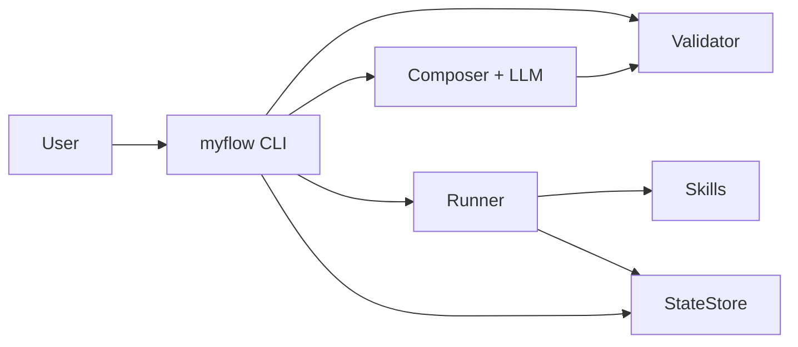

# MyFlow

AI 工作流生成与执行引擎：用自然语言生成 YAML 工作流，经确定性校验后由 Runner 逐步执行，并支持断点续跑与运行记录查询。

**目录（大节）** 
[第一部分 设计与架构综述](#part1) 
[第二部分 安装与使用指南](#part2)

---

<a id="part1"></a>

## 第一部分：设计与架构综述

**本部分目录** 

[1.1 设计亮点](#11-设计亮点) 
[1.2 架构与数据流](#12-架构与数据流) 
[1.3 核心对象一览](#13-核心对象一览) 
[1.4 设计演进与变更要点](#14-设计演进与变更要点) 
[1.5 质量指标与阶段四完成线](#15-质量指标与阶段四完成线) 
[1.6 开发状态说明](#16-开发状态说明)

### 1.1 设计亮点

- **三层架构，依赖单向向下。** 入口层（CLI）只做解析与展示；引擎层（Runner / Validator / Composer / Skills）承载全部业务；基础设施层（StateStore / LLMClient / Config）适配外部依赖。任何一层都不反向 import 上层。对应 [设计文档](MyFlow_完整设计文档.md) §3。
- **YAML 替代 Markdown DSL。** 工作流定义使用标准 YAML 格式，有成熟解析器（ruamel.yaml），无需自写正则 Parser。LLM 生成 YAML 比生成特定格式的 Markdown 更稳定，且 YAML 与 Pydantic 的 dict 形式天然兼容。对应设计文档 §4。
- **模板解析三类语义。** `step.inputs` 中整段 `{{var}}`（保留原始类型）、字符串内插多占位（逐个替换为 `str`）、以及无花括号的字面量，由 Runner 统一解析。这是修复「合规 YAML 仍带未展开 `{{…}}`」类问题的基础。根因讨论见 [benchmark_failures.md](tests/e2e/benchmark_failures.md) P1。
- **每步 `outputs` 为显式 dict 映射。** `key` 为写入运行上下文的变量名，`value` 为技能 Pydantic 输出模型上的字段名。配合校验器的 `INVALID_OUTPUT_FIELD` 错误码，避免「技能只返回 `generated_text`、下游却引用 `final_document`」类静默空结果。对应设计文档 §4.2–§4.4。
- **确定性校验 + Composer 回流闭环。** `myflow generate` 在 `compose_until_valid` 中把 `Validator` 报告反馈给 LLM，直到 `execution_ready()` 为真或达最大重试。阻塞级 warning（如 `MERGEABLE_LLM_ANALYZE`）会参与该闭环。见 [benchmark_failures.md](tests/e2e/benchmark_failures.md) §8 与 [composer_system.md](src/myflow/prompts/composer_system.md)。
- **SkillCard 自动注入 Prompt。** 每个 Skill 类声明 `name / description / when_to_use / do_not_use_when / input_model / output_model`，SkillRegistry 在启动时自动提取为 SkillCard 文本并嵌入 Composer 的 System Prompt。LLM 无需"读一遍脚本"即可知道有哪些技能、怎么用。对应设计文档 §6。
- **Composer 二合一替代三角色。** 没有 Planner / Generator / Evaluator 三角色分离，一个 Composer + 一次 LLM 调用直出 WorkflowModel。Token 成本和调试复杂度降低一半。对应设计文档 §7.2。


### 1.1.1 与前代项目（MyWorkflow V1–V4）的关键差异

| 维度 | 前代设计 | MyFlow | 改变原因 |
|------|---------|--------|---------|
| 工作流格式 | `.step.md`（Markdown DSL） | YAML | 标准解析器、LLM 生成更稳定 |
| LLM 角色数 | 3（Planner / Generator / Evaluator） | 1（Composer 二合一） | 减少 Token 成本和调试复杂度 |
| 校验模块 | 10 个文件的独立协议层 | 1 个 `validator.py` | 保留核心逻辑，砍掉过度抽象 |
| 结构化输出 | LangChain structured output | instructor + 原生 SDK | 减少抽象层，更可控 |
| 入口 | `main.py` 硬编码路径 | Typer CLI + Rich 输出 | CLI-First，专业美观 |
| 状态存储 | SQLite + 部分 pickle | SQLite + 全量 JSON | 安全序列化 |
| 元工作流 | 系统自身就是工作流 | 稳定后再考虑 | MVP 先行 |


### 1.2 架构与数据流



**生成路径：** 自然语言需求 → `WorkflowComposer` 调用 LLM（instructor 强制结构化输出）→ `WorkflowModel`（Pydantic 对象）→ `Validator` 确定性校验（技能白名单、变量可达性、输出字段合法性等 11+ 条规则）→ 校验通过则落盘 YAML；未通过则错误回流 Composer 重试。

**执行路径：** 加载 YAML → `Runner` 按步执行。每步依次完成：条件求值（simpleeval 沙盒）→ 解析 `inputs` 模板（整段引用 / 字符串内插 / 字面量）→ Pydantic 校验输入 → 调用 Skill → 按 `outputs` 映射写回上下文 → 持久化到 SQLite。支持 `on_fail` 重试跳转（上限 5 次）和 `--resume` 断点续传。

### 1.3 核心对象一览

下表列出系统中的关键 Pydantic 模型与模块，便于快速定位代码。

| 对象 | 文件 | 职责 |
|------|------|------|
| `WorkflowModel` | `engine/models.py` | 工作流完整定义：元数据 + 步骤列表 |
| `WorkflowStep` | `engine/models.py` | 单步定义：action、inputs、outputs、on_fail 等 |
| `ParamSpec` | `engine/models.py` | 工作流级输入/输出参数规格（类型、描述、是否必填） |
| `ValidationReport` | `engine/models.py` | 校验结果：errors / warnings / `execution_ready()` |
| `SkillCard` | `engine/models.py` | 技能元数据摘要，注入 Composer Prompt |
| `RunResult` / `StepResult` | `engine/models.py` | 运行与单步执行结果 |
| `Runner` | `engine/runner.py` | 步骤循环引擎，驱动工作流执行 |
| `WorkflowComposer` | `engine/composer.py` | LLM 工作流生成，调用 `compose_until_valid` |
| `WorkflowValidator` | `engine/validator.py` | 确定性规则校验（11+ 条规则） |
| `SkillRegistry` | `engine/skill_registry.py` | 技能注册、查找、SkillCard 生成 |
| `Skill` (抽象基类) | `skills/base.py` | 所有技能的接口定义 |
| `FileReaderSkill` | `skills/file_ops.py` | 统一读取：单文件 / 多文件 / 目录 / ZIP |
| `LLMAnalyzeSkill` | `skills/llm_call.py` | LLM 分析：归纳、对比、要点提取 |
| `LLMGenerateSkill` | `skills/llm_call.py` | LLM 生成：报告、代码、翻译 |
| `LLMVerifySkill` | `skills/llm_call.py` | LLM 验证：对照标准检查产物 |
| `StateStore` | `infra/state_store.py` | SQLite 状态持久化（run / step / checkpoint） |
| `LLMClient` | `infra/llm_client.py` | instructor + LLM SDK 封装 |
| `AppConfig` | `infra/config.py` | pydantic-settings 配置加载 |

### 1.3.1 Validator 校验规则一览

Validator 是系统的确定性判官。以下为当前实现的全部规则（代码层面的唯一来源）：

| 规则编号 | 错误码 | 规则描述 | 阻塞级 |
|---------|--------|---------|--------|
| R01 | `EMPTY_STEPS` | steps 列表不能为空 | 是 |
| R02 | `DUPLICATE_STEP_ID` | step.id 必须唯一且为正整数 | 是 |
| R03 | `UNKNOWN_ACTION` | step.action 必须在 SkillRegistry 白名单中 | 是 |
| R04 | `MISSING_OUTPUT` | step.outputs 至少声明一个变量 | 是 |
| R05 | `UNBOUND_VARIABLE` | inputs 引用的变量必须在前序 outputs 或工作流 inputs 中已声明 | 是 |
| R06 | `INVALID_ON_FAIL` | on_fail 目标必须 < 当前 step.id | 是 |
| R07 | `ON_FAIL_TARGET_MISSING` | on_fail 目标 step.id 必须实际存在 | 是 |
| R08 | `EXCESSIVE_RETRIES` | max_retries 不能超过 5 | 是 |
| R09 | `TEMPLATE_RESIDUE` | inputs 中不能残留空的模板语法 | 是 |
| R10 | `DANGER_KEYWORD` | description 中出现危险关键词时记录警告 | 警告 |
| R11 | `MISSING_WORKFLOW_PATH` | action=sub_workflow 时 workflow 字段必填 | 是 |
| R12 | `INVALID_OUTPUT_FIELD` | outputs 的 value 必须是该技能的合法输出字段 | 是 |
| — | `MERGEABLE_LLM_ANALYZE` | 多步 llm_analyze 且同 content 字面量应合并 | 阻塞级 warning |
| — | `SINGLE_BRACE_STYLE` | 整段单花括号建议改为双花括号 | 非阻塞 warning |

**`execution_ready()` 的语义：** `passed=True`（无 error）且无阻塞级 warning。`MERGEABLE_LLM_ANALYZE` 在 `BLOCKING_WARNING_CODES` 中，因此虽然是 warning 但会阻止 `execution_ready()`，并驱动 Composer 回流重试。

### 1.3.2 技能选择决策指南

| 场景 | 应选技能 | 常见误选 | 原因 |
|------|---------|---------|------|
| 总结 / 摘要 / 概括 / 提取要点 | `llm_analyze` | `llm_generate` | analyze 的 Skill Prompt 天然约束简洁输出 |
| 翻译 / 撰写 / 改写 / 生成代码 | `llm_generate` | — | 产出新内容 |
| 判断产物是否合格 | `llm_verify` | `llm_analyze` | verify 返回结构化的 passed/failed |
| 读取单个或多个文件 | `file_reader` | 自造 `csv_reader` 等 | file_reader 统一支持多种输入形态 |
| 最终保存结果 | `file_writer` | `llm_generate`（做汇总） | file_writer 的字符串内插是确定性的 |

### 1.4 设计演进与变更要点

下表将设计文档、根因级清单 [benchmark_failures.md](tests/e2e/benchmark_failures.md) 与当前实现对齐，标出「因何类问题」触发的方向性修改。

| 问题 ID | 现象 / 根因（摘要） | 主要落点 | 性质 |
|--------|-------------------|----------|------|
| P1 | 仅整段 `{{var}}` 时，串内多占位不展开，落盘与执行带未替换 `{{…}}` | [runner.py](src/myflow/engine/runner.py) 模板解析；设计文档 §4.2.1、§7.3 | 基础设施缺陷 |
| P2 | LLM 正文中留 `{{…}}`、`<待填写>` 等占位式交付 | [llm_call.py](src/myflow/skills/llm_call.py) system prompt 与 `_reject_placeholder_delivery` 后置检查 | LLM 技能 + Prompt |
| P3 | 输出与给定输入脱节（长代码、跑题） | Composer「锚定输入」规则 + `llm_verify`；设计文档阶段 4 / Prompt | 质量迭代 |
| P4 | 多路径拼进单个 `file_reader` → ENOENT | 统一 `file_reader`（支持单文件 / 多路径 / 目录 / ZIP）；设计文档 §6.3 | 技能能力 |
| P5 | 目录当文件读 / 权限失败 | 同 P4，`file_reader` 运行时识别目录并递归读取 | 技能与路径语义 |
| P6 | 批量脚本把路径填进「文案类」字段 | `scripts/batch_requirement_e2e.py` 与 `run_specs` 语义修正 | 批量与夹具 |
| P7 | 带 `--from-id` 等重跑时 `SUMMARY` 与全量历史列含义不一致 | [SUMMARY.md](requirement_batch_io/SUMMARY.md) 表头说明 | 报告脚本语义 |
| P8 | 无真正质量门闩的「成功」 | 工作流设计可加强 `llm_verify` 或外置检查 | 成功定义 |
| P9 | 多步同 `llm_analyze` 且同主输入应合并 | [composer_system.md](src/myflow/prompts/composer_system.md) 机械规则 + [validator.py](src/myflow/engine/validator.py) `MERGEABLE_LLM_ANALYZE` | Prompt + 确定性兜底 |

**与 P1–P9 正交的关键工程修正：**

`step.outputs` 从 `list[str]` 演进为 `dict[str, str]` 显式映射。Runner 仅按映射写入上下文，取消易错的隐式猜测。校验器新增 `INVALID_OUTPUT_FIELD` 错误码，在生成阶段即可发现「YAML 声明的输出字段名与技能实际返回字段名不一致」。规范与错误码以设计文档 §4.2、§4.3、§4.4 与 `Validator` 实现为准。

### 1.5 质量指标与阶段四完成线

设计文档 §13.3 定义了可统计的指标与目标；§15 阶段 4 将其中与对外交付强相关的三条写为进入阶段 5 的完成线：

| 指标 | 定义 | 目标值 | 测量方法 |
|------|------|--------|---------|
| 工作流可执行率 | 生成的工作流能通过 `execution_ready()` 严格校验的比例 | ≥ 90% | 对测试需求各生成 3 次，统计通过率 |
| 技能命中率 | 工作流中 `action` 全部在已注册技能白名单内的比例 | ≥ 95% | 同上 |
| 端到端成功率 | 生成的工作流能被 Runner 成功执行完成的比例 | ≥ 70% | 20 条真实需求批跑 + e2e 测试 |

**当前观测（截至 [SUMMARY.md](requirement_batch_io/SUMMARY.md) 最近快照）：**

- 20 条需求均已生成且校验列通过（可执行率 100%，含阻塞级 warning 重试后收敛）。
- 尝试执行 20 条，端到端成功 **17/20 = 85.0%**（含读盘修复与复测后的合并口径，详见 [benchmark_failures.md](tests/e2e/benchmark_failures.md) §10.5）。
- 仍失败的 3 条（01、10、18）主要失败于 `llm_verify`（翻译质量 / 测试代码质量），非引擎或读盘问题。

**说明：** SUMMARY.md 由 `scripts/requirement_batch_report.py` 自动生成，会随重跑覆盖。上述数字仅为观测值，不等于已达阶段 4 完成线的正式声明。

### 1.6 开发状态说明

- **仍在积极开发。** 引擎、Composer、CLI 与测试持续迭代；以仓库代码与设计文档修订为最终依据。
- **阶段 5（HTTP / `serve` / `http_request`）：** 设计文档 §17 已规划，本仓库尚未提供 `myflow serve` 或对应技能文件。
- **阶段 4 质量收敛：** 批量汇总未达到 §13.3 / §15 阶段 4 完成标志中的全部阈值时，项目按设计文档约定冻结阶段 5 主线开发，优先收敛引擎与 Prompt。
- **设计文档与代码不一致时：** 以代码为准。设计文档末尾附录 B 对已知差异有说明。

---

<a id="part2"></a>

## 第二部分：安装与使用指南

**本部分目录** 
[2.1 环境与依赖](#21-环境与依赖) 
[2.2 安装](#22-安装) 
[2.3 CLI 命令一览](#23-cli-命令一览) 
[2.4 命令详解](#24-命令详解) 
[2.5 调用示例](#25-调用示例) 
[2.6 环境变量](#26-环境变量) 
[2.7 工作流 YAML 编写指南](#27-工作流-yaml-编写指南) 
[2.8 批量测试与回归](#28-批量测试与回归)


### 2.1 环境与依赖

- **Python**：≥ 3.11（见 [pyproject.toml](pyproject.toml)）。
- **包管理**：推荐使用 [uv](https://docs.astral.sh/uv/)。
- **LLM API**：需要 Anthropic / OpenAI / DeepSeek 等提供商的 API Key。

### 2.2 安装

```bash
git clone <本仓库 URL>
cd workflow3.0
uv sync
cp .env.example .env   # Windows: copy .env.example .env
```

编辑 `.env`，至少配置 **`MYFLOW_LLM_API_KEY`**（详见 [2.6](#26-环境变量)）。

验证安装成功：

```bash
uv run myflow --help
```

入口命令为 **`myflow`**（由 [pyproject.toml](pyproject.toml) `[project.scripts]` 注册）。

### 2.3 CLI 命令一览

| 命令 | 作用 | 说明 |
|------|------|------|
| `myflow` | 根命令 | 支持 `--debug` 全局选项 |
| `myflow run` | 执行工作流 YAML | 支持 `--input`、`--verbose`、`--resume` |
| `myflow generate` | 自然语言生成工作流 | 支持 `--output`、`--run`（生成后立即执行）|
| `myflow validate` | 校验 YAML 定义 | 含阻塞级 warning 时 exit 非 0 |
| `myflow list-workflows` | 列出工作流目录下所有 YAML 摘要 | 扫描 `MYFLOW_WORKFLOWS_DIR` |
| `myflow show` | 展示单个工作流的契约与步骤 | 含输入/输出参数、步骤列表、用法示例 |
| `myflow list` | 列出运行记录（SQLite） | 不同于 `list-workflows`：后者列 YAML 定义，本命令列执行历史 |
| `myflow logs` | 查看某次运行的步骤历史 | 支持 run_id 前缀匹配 |
| `myflow status` | 查看单次运行状态与断点 | 缺省时打印用法并列出最近运行 |

常见退出码：成功 `0`；校验/业务失败 `1`；参数或路径错误 `2`。

### 2.4 命令详解

以下与 `uv run myflow <cmd> --help` 一致（节选说明）。

#### 2.4.1 全局选项

```bash
myflow [--debug]
```

| 选项 | 含义 |
|------|------|
| `--debug` | 启用结构化调试日志（stderr）；也可设环境变量 `MYFLOW_DEBUG=1` |

#### 2.4.2 `myflow run`

```bash
myflow run [OPTIONS] WORKFLOW_PATH
```

| 参数/选项 | 含义 |
|-----------|------|
| `WORKFLOW_PATH` | 工作流 YAML 路径；可用相对路径，也可省略 `.yaml` 后缀 |
| `-i`, `--input` | 多次传入 `key=value`，注入工作流 `inputs`。每个 key 对应工作流 `inputs` 中声明的参数名 |
| `-v`, `--verbose` | 每步成功后打印该步全部 `outputs` 内容到终端 |
| `--resume` | 指定 `run_id`，从上次中断的步骤断点续跑 |

**关于 `--verbose` 与终端展示：** 当工作流未使用 `file_writer`（或用户未要求落盘）时，引擎默认在 CLI 中展示最后一步的 `outputs`。加 `--verbose` 后展示每一步的 `outputs`。这意味着「不写文件、只看终端结果」的工作流完全可行。

#### 2.4.3 `myflow generate`

```bash
myflow generate [OPTIONS] REQUIREMENT
```

| 参数/选项 | 含义 |
|-----------|------|
| `REQUIREMENT` | 自然语言需求描述（用引号包裹） |
| `-o`, `--output` | 输出 YAML 路径（默认写入 `MYFLOW_WORKFLOWS_DIR` 下） |
| `-v`, `--verbose` | 显示校验与重试过程 |
| `--run` | 校验通过后立即执行（无初始 `--input`，需与工作流契约一致） |

**内部流程：** Composer 调用 LLM → 得到 WorkflowModel → Validator 校验 → 如果 `execution_ready()` 为 false → 将错误回流给 LLM → 重试（最多 `MYFLOW_COMPOSER_MAX_ATTEMPTS` 次）→ 通过则保存 YAML。

#### 2.4.4 `myflow validate`

```bash
myflow validate WORKFLOW_PATH
```

对单文件做与 `generate` 后相同的严格校验。含阻塞级 warning（如 `MERGEABLE_LLM_ANALYZE`）时 exit 非 0。

#### 2.4.5 `myflow list-workflows`

无额外参数；扫描 `MYFLOW_WORKFLOWS_DIR`，按名称列出每个 YAML 的 `name`、`description`、步骤数。

#### 2.4.6 `myflow show`

```bash
myflow show NAME_OR_PATH
```

按逻辑名、相对或绝对路径定位一个工作流，展示：输入参数表（类型、是否必填、描述）、输出参数表、步骤列表（含 on_fail 信息）、命令行用法示例。与 `list-workflows` 配合使用：先 `list-workflows` 找到名字，再 `show` 查看详情。

#### 2.4.7 `myflow list`

```bash
myflow list [OPTIONS]
```

| 选项 | 含义 |
|------|------|
| `-n`, `--limit` | 列出最近若干条运行，默认 20 |
| `--full-id` | 显示完整 `run_id`（默认显示前 8 位） |

**与 `list-workflows` 的区别：** `list-workflows` 列出磁盘上的工作流定义文件；`list` 列出 SQLite 中的运行记录。一个是"有哪些工作流可以跑"，一个是"跑过哪些、结果如何"。

#### 2.4.8 `myflow logs` 与 `myflow status`

```bash
myflow logs RUN_REF      # run_id 或其唯一前缀
myflow status [RUN_REF]  # 缺省时列出最近运行供选择
```

`logs` 展示该次运行的完整步骤历史（每步状态、耗时、输出摘要）。`status` 展示单次运行的当前状态与断点位置（适用于 `--resume` 前确认）。

### 2.5 调用示例

#### 基本工作流程（生成 → 校验 → 执行）

```bash
# 1. 生成工作流
uv run myflow generate "读取 README.md，用 LLM 总结要点" -o workflows/summarize.yaml

# 2. 查看生成的工作流结构
uv run myflow show summarize

# 3. 校验（可选，generate 内部已校验）
uv run myflow validate workflows/summarize.yaml

# 4. 执行
uv run myflow run workflows/summarize.yaml -i file_path=./README.md -v
```

#### 多输入参数

```bash
uv run myflow run workflows/translate_doc.yaml \
  -i source_path=./paper.txt \
  -i target_language=中文 \
  -i output_path=./paper_cn.txt
```

#### 断点续传

```bash
# 首次执行中断后
uv run myflow list              # 找到 run_id
uv run myflow status abc12def   # 确认断点位置
uv run myflow run workflows/my_wf.yaml --resume abc12def
```

#### 生成后立即执行

```bash
uv run myflow generate "分析 data.csv 的数据趋势" --run
```

#### 管理命令

```bash
uv run myflow list-workflows    # 列出所有可用工作流
uv run myflow list              # 列出运行历史
uv run myflow logs abc12def     # 查看某次运行详情
```

#### 批量需求汇总（20 条）

```bash
# 全量批跑（会改写 requirement_batch_io/SUMMARY.md）
uv run python scripts/requirement_batch_report.py

# 从第 11 条开始（跳过已跑的前 10 条）
uv run python scripts/requirement_batch_report.py --from-id 11

# 跳过特定条目（如卡在 10 和 18）
uv run python scripts/requirement_batch_report.py --skip-ids 10,18
```

### 2.6 环境变量

可通过 `.env` 或系统环境变量设置（前缀 **`MYFLOW_`**，由 [config.py](src/myflow/infra/config.py) 读取）。

#### 核心配置

| 变量 | 含义 | 默认值 |
|------|------|--------|
| `MYFLOW_LLM_PROVIDER` | LLM 提供商：`anthropic` / `openai` / `deepseek` 等 | `anthropic` |
| `MYFLOW_LLM_MODEL` | 模型名称 | `claude-sonnet-4-20250514` |
| `MYFLOW_LLM_API_KEY` | API 密钥（`generate` 必需） | — |
| `MYFLOW_LLM_BASE_URL` | 可选，OpenAI 兼容网关地址 | — |
| `MYFLOW_LLM_TEMPERATURE` | 采样温度 | `0.3` |
| `MYFLOW_WORKFLOWS_DIR` | 工作流根目录 | `workflows` |
| `MYFLOW_DB_PATH` | SQLite 路径 | `myflow_state.db` |
| `MYFLOW_DEBUG` | 设为 `1` 等价于 CLI `--debug` | `0` |

#### Composer / 缓存

| 变量 | 含义 |
|------|------|
| `MYFLOW_COMPOSER_MAX_ATTEMPTS` | Composer 校验重试最大次数 |
| `MYFLOW_CHAMPION_CACHE_ENABLED` | 是否启用 Champion 缓存（按需求 hash 复用成功产物）|
| `MYFLOW_CHAMPION_CACHE_DIR` | Champion 缓存目录 |

#### 基准与质量测试

| 变量 | 含义 | 注意 |
|------|------|------|
| `MYFLOW_RUN_BENCHMARK` | 置为 `1` 开启真实 LLM 基准测试 | 会产生 API 费用 |
| `MYFLOW_BENCHMARK_STRICT` | 配合上一项，对 20×3 次生成断言 §13.3 阈值 | 耗时长、费用高 |
| `MYFLOW_RUN_LLM_TESTS` | 部分 live 集成测试开关 | — |

### 2.7 工作流 YAML 编写指南

手动编写或审查 Composer 生成的 YAML 时，注意以下要点（完整规范见设计文档 §4）：

**inputs 的三种合法写法：**

```yaml
inputs:
  # 纯变量引用（保留原始类型）
  content: "{{file_content}}"

  # 字符串内插（变量替换为 str 后拼接）
  instruction: "将以下内容翻译为{{target_language}}：{{source_text}}"

  # 字面量（原样传递）
  criteria: "报告必须包含摘要和结论"
```

**outputs 必须是 dict 映射：**

```yaml
outputs:
  # key: 写入上下文的变量名（自定义）
  # value: 技能 Pydantic 输出模型的字段名（必须与技能定义一致）
  translated_text: generated_text    # 把 llm_generate 的 generated_text 存为 translated_text
  summary: analysis_result           # 把 llm_analyze 的 analysis_result 存为 summary
```

**on_fail 指向正确的步骤：**

```yaml
- id: 3
  name: 验证报告
  action: llm_verify
  on_fail: 2    # 失败时回到步骤 2（生成报告），不是步骤 1（读文件）
  max_retries: 3
```

**已注册的技能名称（`step.action` 只能使用以下值）：**

| 技能 | 用途 | 幂等 | 主要输出字段 |
|------|------|------|-------------|
| `file_reader` | 读取文件（支持单文件、多路径逗号分隔、目录、ZIP） | 是 | `file_content` (str), `file_count` (int) |
| `file_writer` | 写入文件 | 否 | `report_path` (str), `bytes_written` (int) |
| `llm_analyze` | LLM 分析：归纳、对比、要点提取 | 是 | `analysis_result` (str), `confidence` (float) |
| `llm_generate` | LLM 生成：报告、代码、翻译 | 是 | `generated_text` (str) |
| `llm_verify` | LLM 验证：对照标准检查产物 | 是 | `verify_result` (str), `passed` (bool) |
| `sub_workflow` | 调用已注册的子工作流 | — | 由子工作流决定 |

**完整工作流示例（含验证循环）：**

```yaml
name: translate_and_summarize
description: 读取英文论文，翻译为中文并生成摘要
version: "1.0"

inputs:
  paper_path:
    type: string
    description: 英文论文文件路径
  output_path:
    type: string
    description: 输出文件路径

outputs:
  result_path:
    type: string
    description: 翻译与摘要文件路径

steps:
  - id: 1
    name: 读取论文
    action: file_reader
    inputs:
      file_path: "{{paper_path}}"
    outputs:
      paper_content: file_content

  - id: 2
    name: 翻译全文
    action: llm_generate
    inputs:
      instruction: "将以下英文论文翻译为中文，保持学术用语准确性"
      context: "{{paper_content}}"
    outputs:
      translated_text: generated_text

  - id: 3
    name: 生成摘要
    action: llm_analyze
    inputs:
      content: "{{translated_text}}"
      instruction: "用 3-5 句话概括这篇论文的核心观点和结论"
    outputs:
      summary: analysis_result

  - id: 4
    name: 验证摘要质量
    action: llm_verify
    inputs:
      artifact: "{{summary}}"
      criteria: "摘要必须涵盖论文的研究目的、方法和结论，不得遗漏核心论点"
    outputs:
      verify_result: verify_result
    on_fail: 3
    max_retries: 2

  - id: 5
    name: 保存结果
    action: file_writer
    inputs:
      file_path: "{{output_path}}"
      content: "# 摘要\n\n{{summary}}\n\n---\n\n# 全文翻译\n\n{{translated_text}}"
    outputs:
      result_path: report_path
```

**常见错误与正确写法：**

| 错误 | 正确 | 原因 |
|------|------|------|
| `outputs: [translated_text]` | `outputs: {translated_text: generated_text}` | outputs 必须是 dict 映射 |
| `action: analyze_data` | `action: llm_analyze` | 必须使用注册的技能名 |
| `on_fail: 5`（当前步 id 也是 5） | `on_fail: 3`（< 当前步 id） | on_fail 只能向前跳 |
| `content: "{{a}},{{b}},{{c}}"` 传给 file_reader | 使用 `multi_file_reader` 或拆多步 | file_reader 按单路径读取 |
| 在工作流 inputs 中暴露 instruction | 将 instruction 写为步骤字面量 | instruction 是实现细节 |

### 2.8 批量测试与回归

20 条真实需求的批量测试体系：

| 组件 | 路径 | 说明 |
|------|------|------|
| 需求元数据 | `requirement_batch_io/batch_manifest.yaml` | 20 条需求定义（id、分级、需求文本、夹具提示） |
| 输入夹具 | `requirement_batch_io/fixtures/` | 各需求对应的测试数据文件 |
| 运行配置 | `requirement_batch_io/run_specs.yaml` | 每条需求的 `--input` 参数 |
| 运行产物 | `requirement_batch_io/runs/XX/` | 各需求的执行输出文件 |
| 汇总报告 | `requirement_batch_io/SUMMARY.md` | 脚本自动生成的一览表（随重跑覆盖） |
| 批量脚本 | `scripts/requirement_batch_report.py` | 全量或子集批跑 + 汇总 |
| 失败分析 | `tests/e2e/benchmark_failures.md` | 根因级失败形态与修复追踪（P1–P9） |

---

## 阶段实施与测试记录

- 继续阅读：[`开发与测试记录.md` · 阶段实施与测试记录](开发与测试记录.md#阶段实施与测试记录原-readme-第三部分)
- 相关：失败形态根因清单见 [benchmark_failures.md](tests/e2e/benchmark_failures.md)


